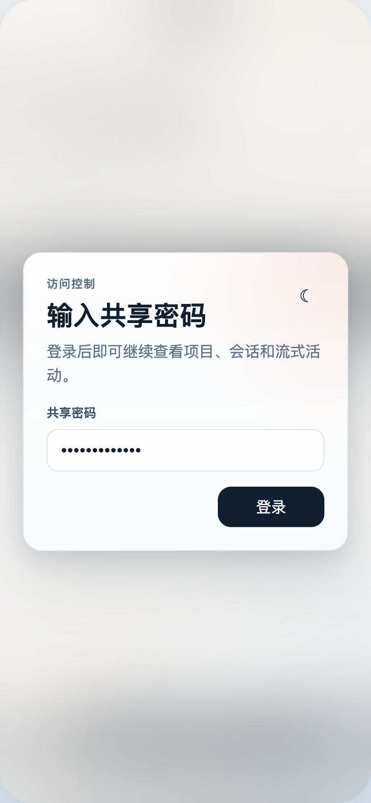
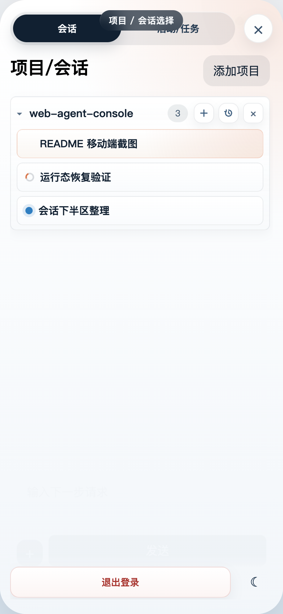
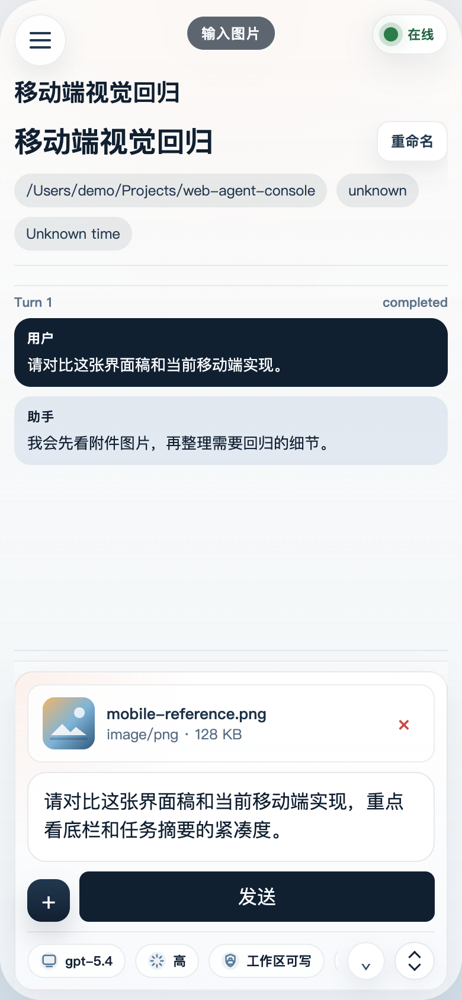
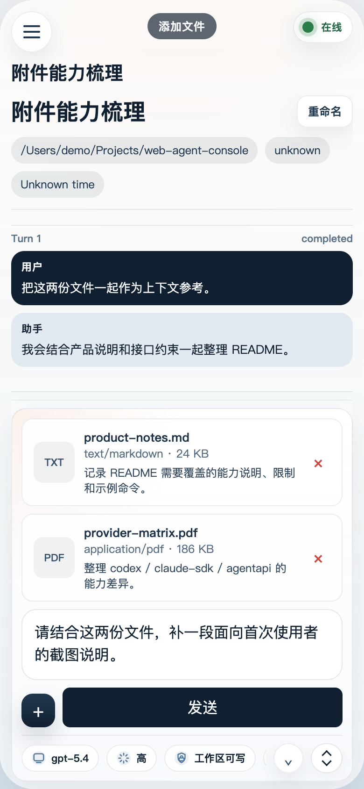
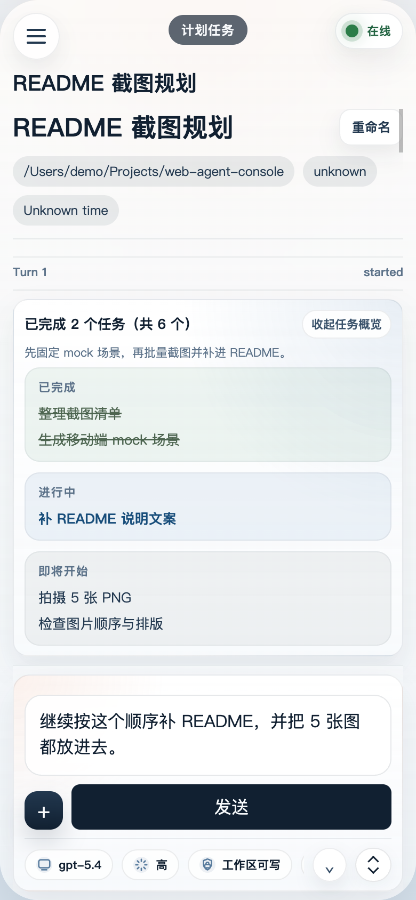

# Web Agent Console

Web Agent Console 是一个本地优先的浏览器控制台，用来查看和操作命令行 Agent 会话。它把项目列表、会话历史、流式输出、审批、用户提问和附件交互集中到一个 Web 界面里，方便你在浏览器里观察和继续本地 Agent 工作流。

当前项目支持两条主要后端路径：

- `codex`：通过受控的 `codex app-server` 驱动会话
- `claude-sdk`：通过 `@anthropic-ai/claude-agent-sdk` 复用本地 Claude 会话与认证

这仍然是一个本地优先的 PoC，更适合个人使用、原型验证和内部工具场景，而不是直接作为生产部署方案。

## 移动端截图

以下截图均使用 README 专用的 mock 假数据生成，只用于展示移动端界面结构与交互布局。

<table>
  <tr>
    <td align="center">
      
      <br />
      <sub>共享密码输入</sub>
    </td>
    <td align="center">
      
      <br />
      <sub>项目 / 会话选择</sub>
    </td>
    <td align="center">
      
      <br />
      <sub>输入图片</sub>
    </td>
  </tr>
  <tr>
    <td align="center">
      
      <br />
      <sub>添加文件</sub>
    </td>
    <td align="center">
      
      <br />
      <sub>计划任务</sub>
    </td>
    <td></td>
  </tr>
</table>

## 主要能力

- 按工作目录聚合项目和会话
- 在浏览器中查看流式输出、任务进度和运行状态
- 在 UI 中处理工具审批和用户问题
- 为单个会话切换模型和推理强度
- 上传附件并按后端能力做校验
- 页面刷新或服务重启后恢复部分会话状态
- 可选共享密码认证
- 可接收独立 Claude 进程回传的 hook 事件

## 适合谁

- 想用浏览器而不是纯终端来观察 Agent 执行过程的人
- 需要在图形界面里完成审批、回答问题、继续对话的人
- 同时维护多个工作目录，希望统一查看会话的人

## 快速开始

### 这部分会帮你完成什么

- 检查本机是否已经具备运行条件
- 用 `npx` 直接启动 Web Agent Console
- 按需切换 `codex` 或 `claude-sdk` provider

### 开始前准备

- Node.js 22+
- 如果使用 `codex` provider，需要本地 `codex` 可执行文件和可用的登录态
- 如果使用 `claude-sdk` provider，需要本地 Claude Code / Agent SDK 登录态

### 1. 先检查本地环境

先确认本机是否具备 `codex` 和 `claude-sdk` 的基础运行条件：

```bash
npx web-agent-console doctor
```

这个命令会检查：

- Node.js 版本
- `codex` 是否已安装
- `@anthropic-ai/claude-agent-sdk` 是否可解析
- `claude`（Claude Code CLI）是否已安装
- Claude 的基础认证信号是否存在

如果你愿意让 CLI 自动执行安全修复，可以使用：

```bash
npx web-agent-console doctor --fix
```

当前 `--fix` 只会自动尝试修复适合脚本化处理的项目，比如安装缺失的 Claude Code CLI。`codex` 安装和 Claude 登录态仍然会给出人工修复建议。

### 2. 直接启动

```bash
npx web-agent-console
```

默认会启动 `codex` provider，并在 `http://127.0.0.1:4318` 提供 Web 界面。

如果你希望启动后自动打开浏览器：

```bash
npx web-agent-console --open
```

### 3. 选择后端 provider

使用 `codex`：

```bash
npx web-agent-console --provider codex
```

使用 `claude-sdk`：

```bash
npx web-agent-console --provider claude-sdk
```

### 4. 常用命令

```bash
web-agent-console start
web-agent-console --open
web-agent-console --host 0.0.0.0 --port 4533 --password demo-password
web-agent-console --sandbox workspace-write --approval on-request
web-agent-console doctor
web-agent-console doctor --fix
web-agent-console --help
```

环境变量仍然可用，CLI 参数会覆盖同名环境变量。

### 5. 在仓库中开发

```bash
npm install
npm start
```

### 6. 固定端口启动

如果你想用固定端口调试或在局域网内访问，可以使用：

```bash
./scripts/start-local-4533.sh --help
```

示例：

```bash
WEB_AGENT_AUTH_PASSWORD=demo-password \
./scripts/start-local-4533.sh --sandbox danger-full-access --approval on-request
```

这个脚本默认会把 Web 界面暴露在 `http://0.0.0.0:4533`。

## Provider 支持情况

| Provider | 状态 | 说明 | 附件支持 |
| --- | --- | --- | --- |
| `codex` | 可用 | 当前默认路径，支持会话管理、审批、流式更新和会话设置 | 仅图片 |
| `claude-sdk` | 可用 | 支持 Claude 会话、审批、提问、会话设置和外部 hook 桥接 | 图片、文本、PDF |
| `agentapi` | 未完成 | 当前仅为占位实现，不建议在实际使用中启用 | 不支持 |

## 常见用法

### 启用共享密码认证

```bash
npx web-agent-console --password demo-password
```

### 运行 smoke 检查

```bash
npm run smoke
```

如果你想验证 `claude-sdk` 路径：

```bash
WEB_AGENT_PROVIDER=claude-sdk npm run smoke
```

### 接收 Claude hook 事件

如果你希望把独立运行的 Claude Code 进程中的审批、提问和状态同步到这个控制台，可以使用：

```bash
export CLAUDE_HOOK_SECRET=change-me
export WEB_AGENT_HOOK_SECRET="$CLAUDE_HOOK_SECRET"
export WEB_AGENT_RELAY_URL="http://127.0.0.1:4318"
node ./scripts/claude-hook-relay.mjs
```

## 发布到 npm

如果你要把这个项目作为工具发布，推荐直接发布为 npm CLI 包，而不是改造成纯终端 TUI。当前仓库已经支持 `web-agent-console` 命令入口，典型发布流程是：

```bash
npm test
npm version patch
npm publish --access public
```

如果你使用组织 scope，再把包名改成 `@your-scope/web-agent-console` 后发布即可。

## 注意事项

- 这是本地优先的 PoC，不是生产级多用户平台。
- `codex` 路径默认使用 `danger-full-access` sandbox 和 `on-request` approval policy，如需更严格限制请显式覆盖。
- 如果你通过 `start-local-4533.sh` 对外监听 `0.0.0.0`，建议至少启用 `WEB_AGENT_AUTH_PASSWORD`，并配合主机防火墙使用。
- `agentapi` 目前不是完整实现。
- 不同 provider 的附件能力不同，`codex` 只支持图片，`claude-sdk` 支持图片、文本和 PDF。

## 已知限制

- 还没有完善的多用户、权限、审计和生产级安全模型
- 状态主要保存在本地 JSON 文件中，而不是数据库
- Claude 外部进程与 Web 控制台之间的待处理动作一致性依赖 hook relay 配置是否正确

## 开源协议

本项目采用 [MIT License](LICENSE)，这是一个宽松的开源协议，允许你在保留原始版权和协议声明的前提下自由使用、修改、分发和商业化。

## 开发者文档

如果你要了解项目结构、架构设计、环境变量、状态文件、接口和测试方式，请查看 [DESIGN.md](DESIGN.md)。

## 社区友链

- [LINUX DO](https://linux.do/)
